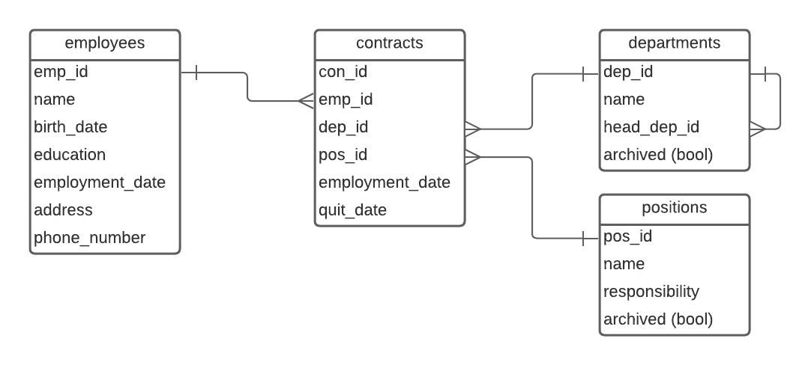

# Система информации о персонале компании
## Поддерживаемые данные
- Служащие
    - ФИО
    - Домашний адрес
    - Образование
    - Срок работы в компании
    - История занимаемых должностей
- Должности
    - Название
    - Обязанности
- Подразделения
    - Название
    - Руководитель
    - Должности (с количеством позиций) и занимающие их люди
    - Внутренние подразделения
    - Головное подразделение
## Поддерживаемые операции
- Получение списка подразделений, структуры подразделений
- Получение списка служащих, в т.ч. по подразделениям, по сроку работы, по должностям
- Получение истории для данного служащего
- Назначение служащего на новую должность в заданном подразделении
- Добавление и удаление служащего, чтение и редактирование данных о нем
- Добавление и удаление подразделения или должности, чтение и редактирование данных о них

## Схема базы данных

## Сценарии использования
### Структура компании
- Получение списка подразделенией, структуры подразделений
    - Открыть главную страницу
- Чтение данных о подразделении
    - Главная → Нужное подразделение
- Редактирование данных о подразделении
    - Главная → Нужное подразделение → Редактировать → Можно изменить название и головное подразделение
- Добавление подразделения
    - Главная → Добавить подразделение → Ввести название, выбрать головное подразделение, сохранить
    - Главная → Выбрать головное подразделение → Создать дочернее → Ввести название, сохранить.
    - Добавить подразделение выше главного в иерархии: Главная → Главное подразделение → Создать головное → Ввести название, сохранить. У бывшего главного автоматически изменится головное.
- Удаление подразделения 
    - Доступно только если у него нет дочерних и в нем никто никогда не работал.
    - Главная → Нужное подразделение → Удалить
    - Если нет активных работников и активных дочерних подразделений, подразделение можно архивировать
    - Главная → Нужное подразделение → Архивировать
    - Такое поведение обусловлено необходимостью корректного хранения истории должностей
### Должности
- Создание должности
    - Главная → Должности → Создать → Заполнить данные, сохранить
- Удаление должности
    - Как и с подразделениями, если никто никогда не занимал эту должность, ее можно удалить
    - Главная → Должности → Нужная должность → Удалить
    - Если нет активных работников, должность можно архивировать.
    - Главная → Должности → Нужная должность → Архивировать
- Чтение данных о долности
    - Главная → Должности → Нужная должность
- Редактирование данных о должности
    - Главная → Должности → Нужная должность → Редактировать → Можно изменить название и обязанности
### Список работников
- Получение списка служащих
    - Главная → Работники
- Получение списка служащих по подразделениям, сроку работы, должностям
    - Главная → Работники → Выбрать нужные фильтры
    - Главная → Нужное подразделение → Список работников подразделения
    - Главная → Должности → Нужная должность → Список работников, занимающих эту должность
- Получение истории для данного служащего
    - Главная → Работники → Поиск по ФИО или фильтрам → Нужный работник → История должностей
- Изменение информации о служащем
    - Главная → Работники → Поиск по ФИО или фильтрам → Нужный работник → Изменить → Изменить необходимые данные, сохранить
- Назначение служащего на другую должность
    - Главная → Работники → Поиск по ФИО или фильтрам → Нужный работник → Изменить → Изменить должность и подразделение, сохранить
- Назначение нового служащего на заданную должность в заданном подразделении
    - Главная → Работники → Добавить → Заполнить данные, выбрать должность и подразделение, сохранить.

## Описание страниц
### На всех страницах меню в верхней части:
- Подразделения
- Работники
- Должности
### Главная (Подразделения)
- Список или дерево подразделений, каждый элемент кликабельный → страница подразделения.
- Чекбокс показывать архив
- Кнопка добавить → страница подразделения в режиме редактирования
### Работники
- Таблица с возможностью фильтрации и поиска
- Каждая строка содержит ФИО работника, образование, должность и подразделение, строка целиком кликабельна → Страница работника.
- Кнопка добавления работника → Страница работника, режим редактирования
### Должности
- Список должностей, каждая кликабельная → Страница должности
- Кнопка создания новой должности → Страница должности, режим редактирования
- Возможно, поиск
### Страница подразделения
- Название
- Головное и дочерние подразделения с кликабельными ссылками → страница подразделения
- У верхнего подразделения в иерархии кнопка создать головное подразделение → Режим редактирования
- Кнопка создать дочернее подразделение → Режим редактирования
- Кнопка архивирования подразделения (только если нет активных работников и активных дочерних подразделений) → через подтверждение на главную
- Кнопка удаления подразделения (только если нет и не было работников и нет и не было дочерних подразделений) → через подтверждение на главную
- Кнопка изменения подразделения → Режим редактирования.
- Таблица работников подразделения, см. страницу Работники, но только это подразделение, сгруппированные по должностям.
### Страница подразделения, режим редактирования
- Та же страница, но Название и Головное подразделение — поля формы, есть кнопка сохранить.
### Страница работника
- Вся информация о работнике из базы
- Текущая должность → Страница должности
- Текущее подразделение → Страница подразделения
- История должностей — таблица с должностью, подразделением и сроком работы
- Кнопка изменить → Режим редактирования.
- Кнопка уволить → через подтверждение, закрывает последнюю должность, оставляет сотрудника без текущей должности.
### Страница работника, режим редактирования
- Та же страница, но все данные можно менять. При изменении должности, старая перейдет в историю.
### Страница должности
- Название
- Обязанности в виде произвольного текста
- Кнопка изменения → Режим редактирования
- Кнопка архивировать → Если нет работников, через подтверждение на Должности.
- Кнопка удалить → Если нет и не было работников, через подтверждение на Должности
- Таблица работников на этой должности, см. страницу Работники, но только эта должность, сгруппированные по подразделениям.
### Страница должности, режим редактирования
- Та же страница, но название и обязанности — поля формы, есть кнопка сохранить.
